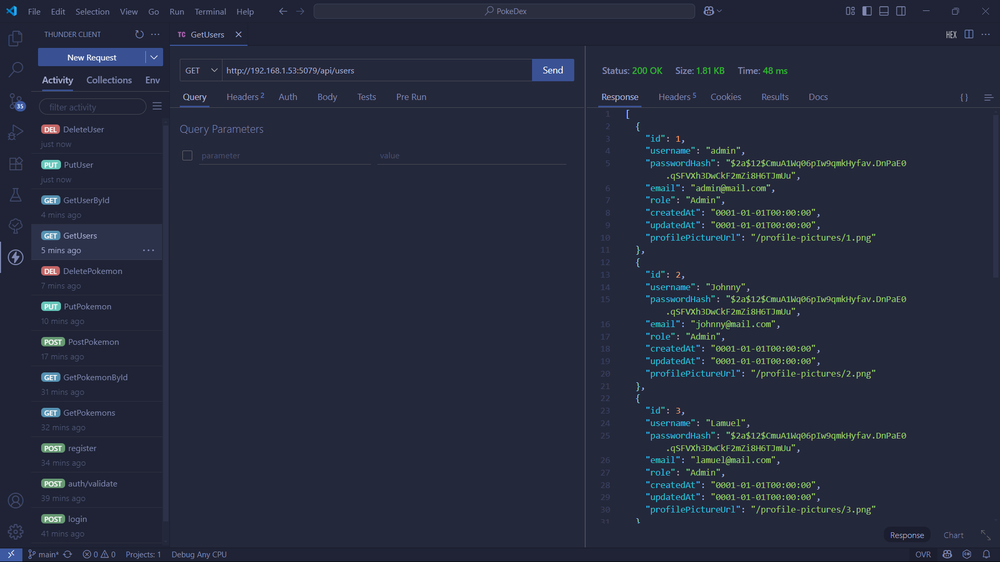
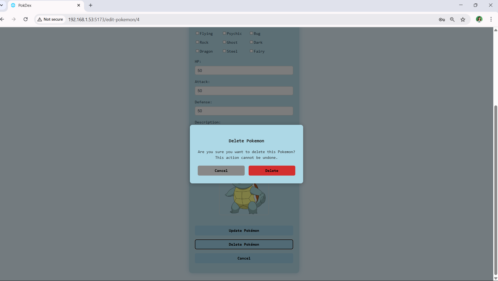

# POKEDEX

## PROJECT OVERVIEW

PokeDex is a web application that allows users to manage a collection of Pokemon.
Admin users can add, edit, or delete Pokemon, while regular users can view the Pokedex. 
The app features secure authentication and a modern, responsive UI.
This project is built with a React frontend and an ASP.NET Core Web API backend, utilizing JWT for authentication and role-based access control.


## TABLE OF CONTENTS
- [FEATURES](#features)
- [TECH STACK](#tech-stack)
- [GETTING STARTED](#getting-started)
- [API ENDPOINTS & SAMPLE USAGE (SCREENSHOTS)](#api-endpoints--sample-usage-screenshots)
- [UI SCREENSHOT](#ui-screenshots)
- [USAGE](#usage)
- [FOLDER STRUCTURE](#folder-structure)

## FEATURES

- User authentication (login, JWT)
- View, add, edit, and delete Pokemon
- User profile management
- Admin dashboard for managing Pokemon
- Responsive design with light and dark modes
- Role-based access (admin/user)
- Responsive UI
  - **UI Showcase:**
    
    <table>
      <tr>
        <th>Light Mode</th>
        <th>Dark Mode</th>
      </tr>
      <tr>
        <td></td>
        <td></td>
      </tr>
    </table>

## TECH STACK

This project uses the following technologies:
- `Frontend`: React, Vite, Axios
- `Backend`: ASP.NET Core Web API, Entity Framework Core
- `Database`: MySQL
- `Authentication`: JWT (JSON Web Tokens)

---

## GETTING STARTED
To run this project locally, follow the setup instructions below. Ensure you have the prerequisites installed on your machine.

### PREREQUISITES
- [Node.js & npm](https://nodejs.org/en/download/) (v22)
- [.NET 8 SDK](https://dotnet.microsoft.com/download/dotnet/8.0)
- [MySQL Server](https://dev.mysql.com/downloads/windows/installer/8.0.html) (v8)
- [MySQL Workbench](https://dev.mysql.com/downloads/windows/installer/8.0.html) (optional, for database management)

---

### MySQL Server Setup
1. `Install` MySQL Server and Workbench.
2. `Set` TCP/IP port to `3306` during installation.
3. `Set` root password to `myPassword1234` (or change it in the `appsettings.json` file).

---

### P2P SETUP
Allow `TCP/IP` connections on port `5079` for frontend and port `5173` for backend in your firewall settings.<br>
  &emsp;&emsp;This is necessary for the frontend to communicate with the backend API when running peer to peer.
  1. Open your firewall settings.
  2. Add a new rule to allow inbound connections on port `5079` for the frontend.
  3. Add another rule to allow inbound connections on port `5173` for the backend.
  4. Ensure that both rules are enabled.
  5. Save the changes and restart your firewall if necessary.

---

### BACKEND SETUP
1. `Navigate` to the backend folder:
   ```sh
   cd PokeDexAPI
   ```
2. `Restore` dependencies and run migrations:
   ```sh
   dotnet tool install --global dotnet-ef // Install EF Core CLI tool if not already installed
   dotnet restore
   dotnet ef database update
   ```
3. `Start` the API:
   ```sh
   dotnet run
   ```
---

### FRONTEND SETUP
1. `Navigate` to the frontend folder:
   ```sh
   cd pokedex-app
   ```
2. `Install` dependencies:
   ```sh
   npm install
   ```
3. `Start` the development server:
   ```sh
   npm run dev
   ```
---

### ENVIROMENT VARIABLES

- The frontend uses a `.env` file for API base URL. It is auto-generated by `update-env.js`.
- Make sure the backend URL in `.env` matches your API server.

---

## FOLDER STRUCTURE
  ```plaintext
   ---------------------------------------------------------------------------
   |            POKEDEX          |                DESCRIPTION                |
   |-----------------------------|-------------------------------------------|
   |         `pokedex-app/`      |               React Frontend              |  
   |-----------------------------|-------------------------------------------|
   |         `PokeDexAPI/`       |            ASP.NET Core Backend           |
   |-----------------------------|-------------------------------------------|
   |        `README-assets/`     |         Documentation Assets (images)     |
   |-----------------------------|-------------------------------------------|
   |          `README.md`        |            Project Documentation          |
   ---------------------------------------------------------------------------
  ```

---

## API ENDPOINTS & SAMPLE USAGE (SCREENSHOTS)

### AUTHENTICATION ENDPOINTS


### POKEMON ENDPOINTS


### USER ENDPOINTS




---

 `EXAMPLE USAGE (login)`:
```http
POST /api/auth/login
Content-Type: application/json

{
  "username": "admin",
  "password": "Password123"
}
```

`EXAMPLE USAGE (get pokemons)`:
```http
GET /api/pokemon
Content-Type: application/json
```

`Response`:
```json
[
  {
    "id": 1,
    "name": "Pikachu",
    "hp": 50,
    "attack": 50,
    "defense": 50,
    "types": [
      "Electric"
    ],
    "description": "When it is angered, it immediately discharges the energy stored in the pouches in its cheeks.",
    "imageUrl": "/pokemon-images/Pikachu_20250623010509754.png"
  },
  {
    "id": 2,
    "name": "Charmander",
    "hp": 50,
    "attack": 50,
    "defense": 50,
    "types": [
      "Fire"
    ],
    "description": "The flame on its tail shows the strength of its life-force. If Charmander is weak, the flame also burns weakly.",
    "imageUrl": "/pokemon-images/Charmander_20250623010537519.png"
  }
]
```
---

## UI SCREENSHOTS





---

## USAGE
- Clone the repository and follow the setup instructions.
- Ensure the backend API is running before starting the frontend.
- Register or log in to access the dashboard.
- Admin users can add, edit, or delete Pokemon.
- Regular users can view the Pokedex.
- Use the navigation bar to access different sections of the app.
- The app supports both light and dark modes, which can be toggled in the settings.
- The frontend is responsive and works well on both desktop and mobile devices.
- The backend API is secured with JWT authentication, ensuring that only authorized users can perform actions based on their roles.

---

## USAGE FOR P2P
- Ensure both frontend and backend are running on the specified ports.
- Access the frontend via `http://<Network IP>:5079` and the backend API via `http://<Network IP>:5173/api`.
- Replace `<Network IP>` with the actual IP address of the machine running the backend.
- Ensure that the firewall rules for ports `5079` and `5173` are correctly set up to allow traffic.

---